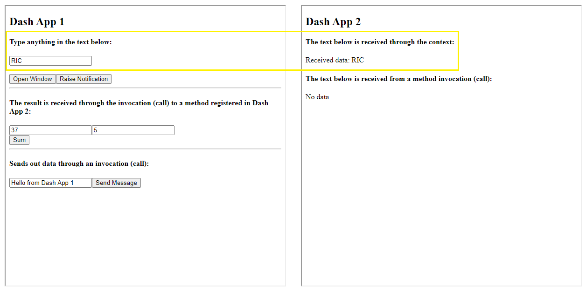
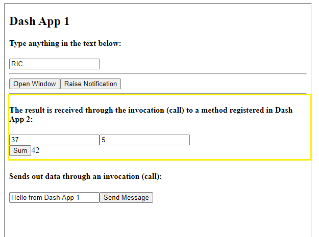
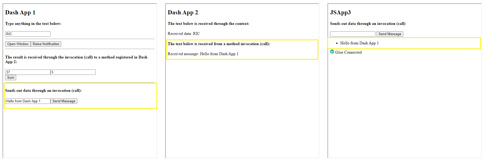
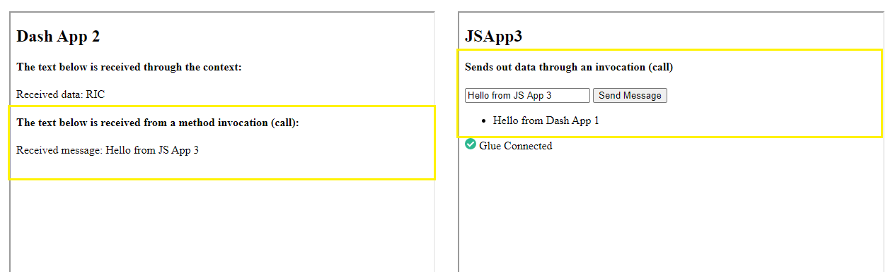

# Overview

This file describes an example implemented with the Glue42 Dash library. The example contains two Dash and one JavaScript applications. The three apps exchange messages through Glue42.

# Shared Context

The example demonstrates how an application (Dash App 1) updates a shared context object and how another application (Dash App 2) subscribes for updates of that shared context.

Type a value into the input field in Dash App 1 to update the context. The same value will be printed in Dash App 2.

# Interop Methods

## Registering and Invoking Methods

Dash App 1 and Dash App 2 demonstrate how to register, invoke and consume results from Interop methods.

On load, Dash App 2 registers a method called "Sum" which accepts two numbers as arguments and calculates their sum. Click the "Sum" button in Dash App 1 to invoke this method. 

The result will be calculated in Dash App 2 and returned so it can be printed in Dash App 1.

## Targeting

The three applications (Dash App 1, Dash App 2 and JS App 3) demonstrate targeting Interop servers when invoking Interop methods.

On load, Dash App 2 and JS App 3 register a method with the same name - "Send.Message". Clicking the button "Send Message" in Dash App 1 invokes the method by targeting all servers offering it (meaning all servers that have registered it). As a result Dash App 2 and JS App 3 will print the value from the input field.

The example also shows a use case when JS App 3 invokes the same registered method by targeting all servers, but skips the current. 
Click "Send Message" in JS App 3 to invoke the method on all servers offering it, but skip the current server (meaning it skips itself so it does not print the same message that it is trying to send to the others apps since JS App 3 is also listening for that same method). 
The value from the input field in JS App 3 will be printed only in Dash App 2.

