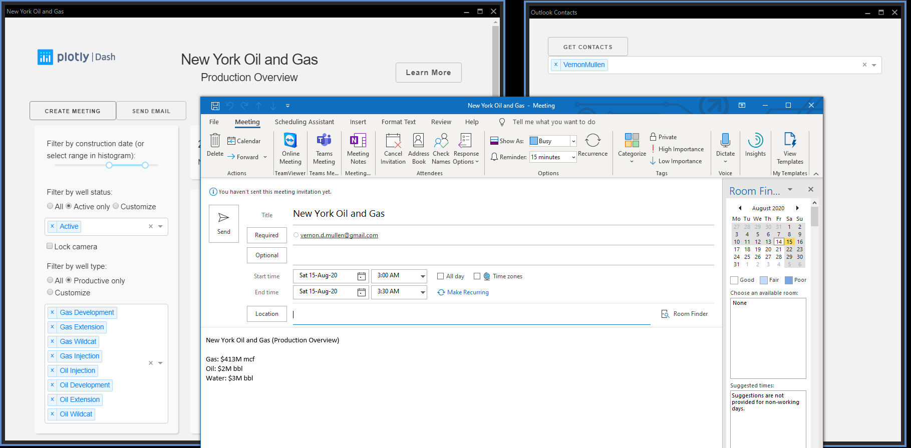
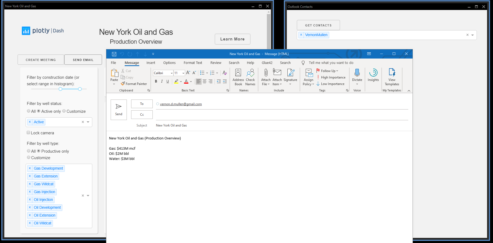

# Dash Natural Gas Well Production (Outlook integration via the Glue42 Outlook Connector)

## About the Applications

The original [New York Oil and Gas](https://dash-gallery.plotly.host/dash-oil-and-gas/) demo app displays oil production in western New York. There are filters at the top of the app to update the graphs below. Selecting or hovering over data in one plot will update the other plots ("cross-filtering").

The example demonstrates integration with Outlook via the Glue42 Outlook Connector - creating a meeting, sending an email and getting Outlook local contacts.

The New York Oil and Gas application has been extended to create meetings and send email. Click "Create Meeting" to invoke a dedicated Interop method (registered by the Outlook Connector) to create a meeting item in Outlook and open the Outlook "Meeting" window. Click "Send Email" to also invoke a dedicated Interop method that creates an email item in Outlook and opens the Outlook "Message" window.

The Outlook Contacts application can retrieve the list of local contacts in Outlook. Click "Get Contacts" button to invoke a dedicated Interop method and consume the results. The list of contacts will be populated in the dropdown menu. If you select any contacts from the menu, those will be set in a shared context named "contacts". The New York Oil and Gas application gets the data of the "contacts" context and uses it as recipients for the meetings/emails.

See [screenshots](#Screenshots).

Checkout the source code in `oil_and_gas_app.py` and `outlook_contacts_app.py` for details.

## Getting Started

1. If you have not setup the environment, follow the instructions in [Quick Start](../README.md). 

2. Install the required packages for this example:

```sh
cd oil-and-gas

pip install -r requirements.txt
```

3. Follow the instructions in [Run an Example Locally](../README.md) to start the applications.

4. Run the applications in a [**Glue42 Enterprise**](../README.md) environment.

## Built With

- [Glue42](https://glue42.com/) - Desktop Integration platform;
- Glue42 Dash - Glue42 Python support for the Dash framework;
- [Dash](https://dash.plot.ly/) - Main server and interactive components;
- [Plotly Python](https://plot.ly/python/) - Used to create the interactive plots;

## Screenshots



 

